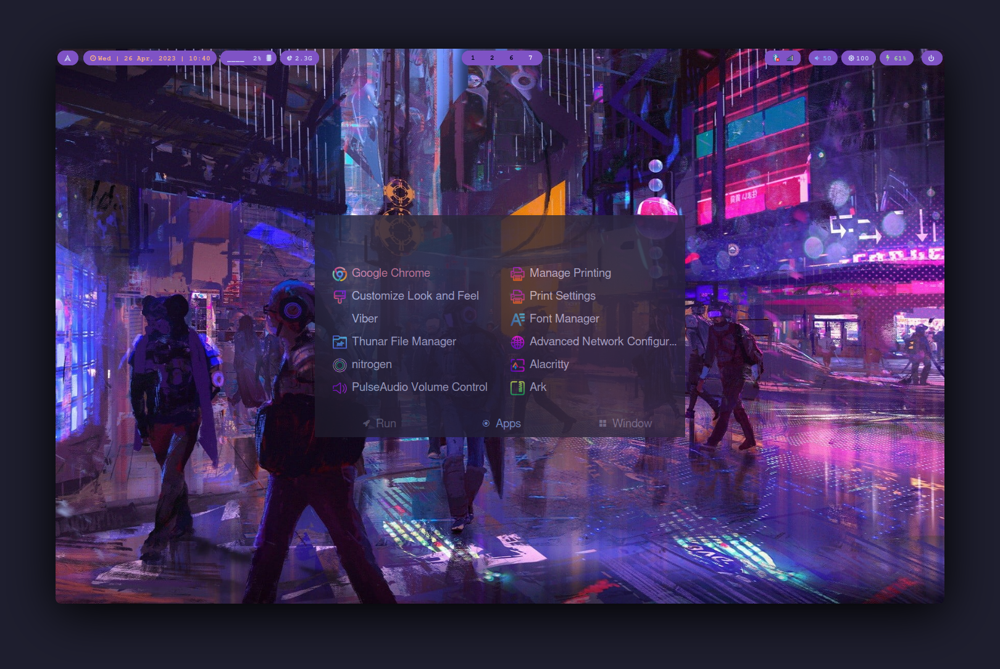

# Hyprland-dots
Hyprland configuration after Vanilla Arch Linux Installation

## You can go to ```github.com/ishanshre/archlinux-setup``` for fresh arch linux installation

# After Fresh Arch Linux Installations:
1. Update the system
2. Install Git
   ```$ sudo pacman -S git```
3. Clone this repo
   ```
   $ git clone https://github.com/ishanshre/Hyprland-dots.git
   $ cd Hyprland-dots
   ```

4. Enable Chaotic Repo from its website or run the script for cloned repo
   ```
   $ chmod +x chaotic-repo.sh
   $ sudo ./chaotic-repo.sh
   ```

5. Install Paru package (Chaotic Repo must be enabled)
   ```$ sudo pacman -S paru-bin ```
6. Run the hyprland script
   ```
   $ chmod +x hyprland.sh
   $ ./hyprland.sh
   ```

7. Install packages (You can edit packages.sh to add or remove packages)
   ```
   $ chmod +x packages.sh
   $ ./packages.sh
   ```

8. Copy .config folder from clone repo to your home directory
   ```$ cp -rf ~/Hyprland-dots/.config ~/```
9.  Copy wallpaper to Pictures (Note. Wallpaper is downloaded from wallpaper flare website)
   ```$ cp 10.jpg ~/Pictures```
11. To change default shell to fish shell
   ```$ chsh -s /usr/bin/fish $USER```
12.  Reboot the System
   
   ## Samples

   ### Sample 1
   
   ### Sample 2 (Rofi menu)
   
   ### Sample 3 (Rofi Power Menu)
   


# My Setup Info
    OS: Arch Linux
    Kernel: linux-lts
    Shell: Fish (https://fishshell.com/)
    Fish Shell Theme: Oh-my-fish (https://github.com/oh-my-fish/oh-my-fish)
    Desktop Environment: Hyprland (https://hyprland.org/)
    Status Pannel: Waybar (https://github.com/Alexays/Waybar)
    Application Menu: Rofi Menu (Catppuccin-mocha theme) (https://github.com/davatorium/rofi)
    Power Menu: Rofi Power Menu (https://github.com/jluttine/rofi-power-menu)
    Theme: Sweet
    Icons: Sweet-Red
    Terminal: Alacritty (https://github.com/alacritty/alacritty)
    Font: Cascadia Code
    File Manager: Thunar
    Image Viewer: Viewnior
    Office: Libre Office
    Code Editor: Neovim and Vscode
